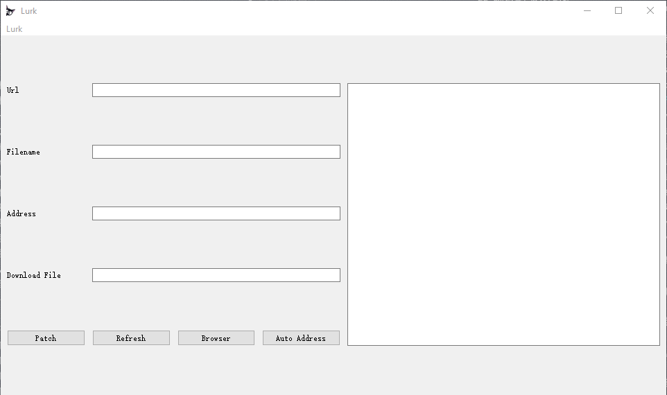

# Lurk

后们绑定命令行/GUI工具。

## FEATURE

- 支持i386架构32位PE程序
- 采用模块化开发（目前GUI只封装了downloadAndExec的功能）
- 功能代码支持以asm/bin/C/dll等形式开发
- 以拓展section的形式增加shellcode
- 支持XOR SMC
- 跨平台

## AV bypass List

欢迎反馈并更新杀软测试结果

- [x] 360
- [x] KasperSky
- [x] Windows Defender
- [x] 火绒

## Getting Start

### Installation

首先你至少要有Python，推荐使用python2.7，你可以从[这里](https://www.python.org/downloads/)选择你需要的版本并下载。

`pip install -r requestments.txt`

#### Troubleshooting

### Useage

*目前只提供GUI界面的使用文档*

主界面

菜单栏中，`Lurk`可以得到Help/About信息，Help可以打开本`README.md`文档

`Url`

该变量定义将下载的目标文件的Url地址，必须以`http://`或`https://`开头。推荐使用如[github.com](github.com)等公知安全的域名，为目标文件下载地址；不推荐使用ip定位的方式。

`Filename`

目标文件，使用`browser`按钮进行填充。

`Address`

patch地址，需要使用者手动确定，后续将自动化该功能。值得注意的是，该地址需要满足以下几个条件。

1. 尽量避免地址出现在循环中。因为我们没有设置shellcode的执行次数，一旦出现在循环中，shellcode将被执行多次，出现不可预计的情况。
2. 尽量避免出现在开头或结尾。开头与结尾是AV的重点检查地址，出现在开头可能会引起AV的警报。
3. patch地址的指令长度必须为5.

`Download Filename`

下载文件的保存名称。如`calc.exe`

`Debug info`

右侧为patch过程中，相关信息的log。

## Task list

- [ ] 支持i386架构64位
- [ ] 支持ELF,Mach-O
- [ ] 实现code cave jump方式添加shellcode
- [ ] 实现新加section方式增加shellcode
- [ ] 自动化寻找可以patch的地址，并测试
- [ ] 添加功能dll
- [ ] 丰富SMC加密算法，如增加AES/DES
- [ ] 完善log信息
- [ ] 实现控制台功能，前端增加控制界面
- [ ] 增加加密通讯功能
- [ ] 添加C/S或者B/S架构，前端只有GUi，功能代码全部放入后端
- [ ] 美化界面
- [ ] 完全模块化

## Development

### Class `class LurkGUI(object)`

为GUI而封装的类。

### Class `class LurkPyQt5(QMainWindows)`

`PyQt5`实现的前端界面。

### Class `class LurkMain(object)`

命令行处理类。

### Class `class Pebin(object)`

`class Pebin(object)`是主要的逻辑实现类，添加新的功能定义私有方法即可。

`self.do_patch(self, filename)`调用`Patcher.inject(raw)`与`Patcher.patch()`进行patch。

### Class `class Patcher(object)`

`class Patcher(object)`是主要涉及PE文件操作的类。

### Dirctoinary `shellcode`

主要shellcode文件夹，`asm`，`dll`，`rawdata`为不同格式存储的shellcode。`tmp`为patch过程中存放的临时生成shellcode。

## Report

如果你有任何关于Bug或功能的想法，欢迎与我联系。`reesummer@protonmail.com`
